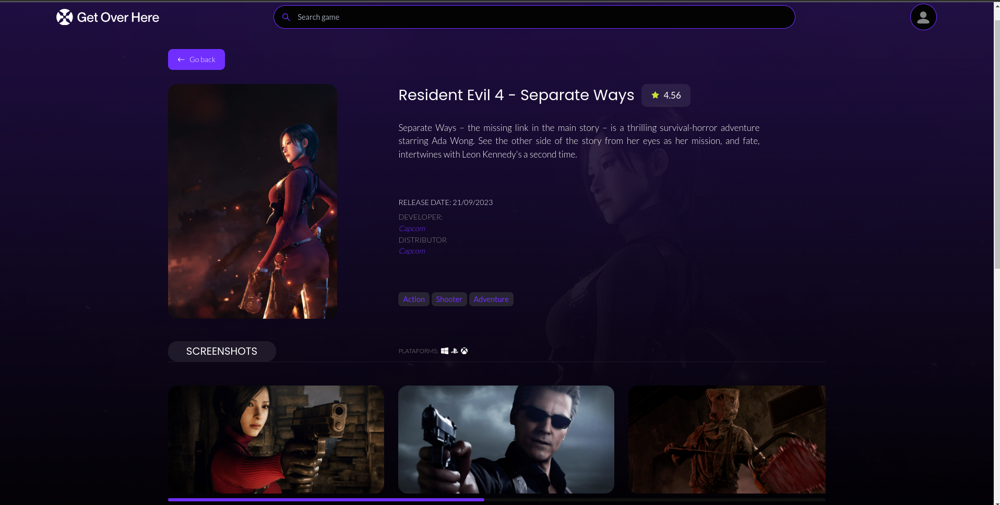

<div>
  <h1 align="center"> 
    
  </h1>
  <h2 align="center"> 
    Get Over Here
  </h2>
  <h3 align="center"> 
    Project developed to improve knowledge with Next 13.
  </h3>

  <p align="center">
    
    
    
    <a href="https://opensource.org/licenses/MIT">
      
    </a>
  </p>
</div>

## About The Project

This project is a web application developed with Next.js and TypeScript, aiming to provide users with an immersive experience with information about 2023's most popular games. The interface is intuitive and accessible, with updates from trusted sources of API.

## Features

- Web application
    - List of games on the server and information about game DLCs
    - Accessibility for users
    - Implementation of file translation
    - Search for specific games in a SearchBar
 
## Technologies

-   **[React](https://reactjs.org/)**
    - [TypeScript](https://www.typescriptlang.org/)
    - [Next](https://nextjs.org/)
    - [Styled Component](https://styled-components.com/) 
    - [Tailwind CSS](https://tailwindcss.com/)
    - [Axios](https://axios-http.com/)
 
## Vercel link
  - Access the application through this link: https://rawg-video-games.vercel.app/
 
## Layout
### Web





## Running The Project

```
# You can use npm or yarn to manage packages

## Clone the repository
git clone https://github.com/Edu4rdoBP/rawg-video-games.git

## Access the project folder in the terminal
cd rawg-video-games

## To install dependencies in server
npm install or yarn install

##
Register to Get an API key on the https://rawg.io/apidocs

## Add your API key to the .env.local file located in the project root: '/.env.local'
NEXT_PUBLIC_API_KEY={add your generated key}

## Run the Server
npm run dev


## Run the Server
npm run storybook
```

## Get an API key

<div align="left">
  <p>
    <a href="https://rawg.io/apidocs">
      RAWG API docs page
    </a>
  </p>
</div>

## License

This project is under the MIT license. See the [LICENSE](/LICENSE) file for more details.


<div align="center">
  <p> Made with 💜 by <a href="https://github.com/Edu4rdoBP">Eduardo Barboza</a> </p>
  <p>
    <a href="https://www.linkedin.com/in/jorgeeder/">
      
    </a>
    <a href = "mailto:jorgeeder.dev@gmail.com">
      
    </a>
  </p>
</div>
